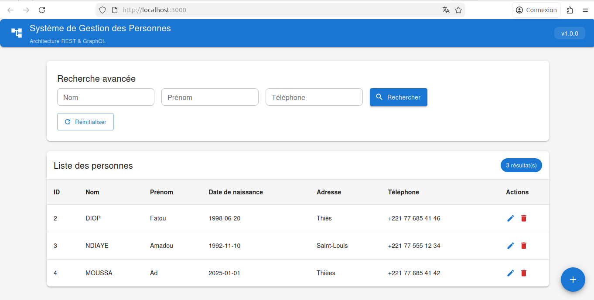
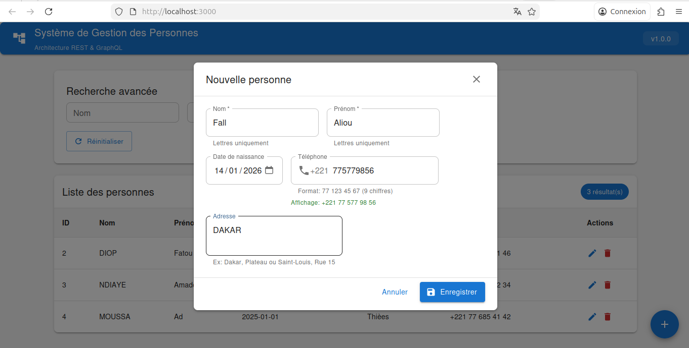
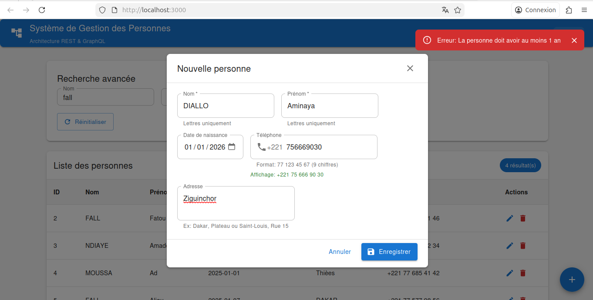

# 📱 Système de Gestion des Personnes

Application fullstack professionnelle de gestion de personnes avec architecture REST et GraphQL.


## 🎯 Description

Projet d'examen - Application CRUD complète démontrant les meilleures pratiques de développement fullstack avec séparation REST/GraphQL.

### Fonctionnalités principales

- ✅ **Création** de personnes (REST POST)
- ✅ **Modification** (REST PUT)
- ✅ **Suppression** (REST DELETE)
- ✅ **Liste complète** (GraphQL Query)
- ✅ **Recherche avancée** avec filtres (GraphQL Query)
- ✅ **Validation stricte** format sénégalais
- ✅ **Interface Material Design** professionnelle
- ✅ **Gestion d'erreurs** centralisée
- ✅ **Notifications** temps réel

## 🏗️ Architecture
```
┌─────────────────────────────────────────────────┐
│         Frontend (React + Material-UI)         │
│              Port: 3000                         │
│  ┌─────────────┐  ┌──────────────────────────┐ │
│  │   Dialog    │  │    Tableau + Recherche   │ │
│  │ Create/Edit │  │      (GraphQL)           │ │
│  │   (REST)    │  │                          │ │
│  └─────────────┘  └──────────────────────────┘ │
└──────────────┬──────────────────────────────────┘
               │ HTTP REST + GraphQL
┌──────────────▼──────────────────────────────────┐
│         Backend (Spring Boot)                   │
│              Port: 8080                         │
│  ┌──────────────┐  ┌──────────────────────────┐│
│  │ REST API     │  │  GraphQL API             ││
│  │ POST/PUT/DEL │  │  Queries                 ││
│  └──────┬───────┘  └────────┬─────────────────┘│
│         │                   │                   │
│  ┌──────▼───────────────────▼─────────────────┐│
│  │         Service Layer                      ││
│  │  - Validations métier                      ││
│  │  - Normalisation données                   ││
│  │  - Formatage téléphone (+221)              ││
│  └──────┬─────────────────────────────────────┘│
│         │                                       │
│  ┌──────▼─────────────────────────────────────┐│
│  │      Repository (Spring Data JPA)          ││
│  └──────┬─────────────────────────────────────┘│
└─────────┼───────────────────────────────────────┘
          │ JDBC
┌─────────▼───────────────────────────────────────┐
│              MariaDB                            │
│              Port: 3306                         │
│         Database: examen_rs_db                  │
└─────────────────────────────────────────────────┘
```

## 🛠️ Stack Technique

### Backend
- **Framework** : Spring Boot 3.2.x
- **Langage** : Java 17
- **Persistence** : Spring Data JPA + Hibernate
- **APIs** : Spring Web (REST) + Spring for GraphQL
- **Base de données** : MariaDB 10.x
- **Validation** : Jakarta Validation
- **Utils** : Lombok

### Frontend
- **Framework** : React 18.2.0
- **UI Library** : Material-UI (MUI) 5.14.0
- **State Management** : React Hooks
- **HTTP Client** : Axios (REST)
- **GraphQL Client** : Apollo Client 3.7.17
- **Build Tool** : Create React App

## 📋 Prérequis

- **Java JDK** 17 ou supérieur
- **Maven** 3.8+
- **Node.js** 16+ et npm
- **MariaDB** 10.x ou MySQL 8.x
- **Git**

## 🚀 Installation et Démarrage

### 1. Cloner le repository
```bash
git clone https://github.com/votre-username/examen-rs-2025.git
cd examen-rs-2025
```

### 2. Base de données
```bash
# Se connecter à MariaDB
mysql -u root -p

# Créer la base de données
CREATE DATABASE IF NOT EXISTS examen_rs_db;
exit;
```

### 3. Backend
```bash
cd backend

# Configurer application.properties (si nécessaire)
# Modifier le mot de passe MariaDB

# Compiler et démarrer
mvn clean install
mvn spring-boot:run
```

✅ Backend disponible sur **http://localhost:8080**

✅ GraphiQL disponible sur **http://localhost:8080/graphiql**

### 4. Frontend
```bash
cd frontend

# Installer les dépendances
npm install

# Démarrer
npm start
```

✅ Frontend disponible sur **http://localhost:3000**

## 📚 Documentation Détaillée

- 📖 [**Backend README**](backend/README.md) - Tests REST, GraphQL, validations
- 📖 [**Frontend README**](frontend/README.md) - Composants, validations, tests

## 🎯 Démarrage Rapide (Quick Start)
```bash
# Terminal 1 - Backend
cd backend && mvn spring-boot:run

# Terminal 2 - Frontend
cd frontend && npm start

# Navigateur
# Ouvrir http://localhost:3000
```

## 🧪 Tests Rapides

### Via l'interface (http://localhost:3000)

1. **Créer** une personne :
   - Nom: Diop
   - Prénom: Moussa
   - Téléphone: 771234567
   - Adresse: Dakar, Plateau

2. **Rechercher** : Taper "Diop" dans le filtre nom

3. **Modifier** : Cliquer sur l'icône ✏️

4. **Supprimer** : Cliquer sur l'icône 🗑️

### Via GraphiQL (http://localhost:8080/graphiql)
```graphql
query {
  allPersonnes {
    id
    nom
    prenom
    telephone
  }
}
```

## 📊 Fonctionnalités Avancées

### Validation Format Sénégalais

- **Téléphone** : 9 chiffres commençant par 7 (77, 78, 76, 75, 70)
- **Affichage** : +221 XX XXX XX XX
- **Unicité** : Vérifiée en base de données

### Validation Données

- **Nom/Prénom** : Lettres uniquement (accents autorisés)
- **Adresse** : Lettres, chiffres, espaces, tirets, virgules, points
- **Date naissance** : Passé uniquement, âge 1-120 ans

### Normalisation Automatique

- Nom → **MAJUSCULES**
- Prénom → **Première lettre majuscule**
- Téléphone → **Formaté avec espaces**

## 🔧 Configuration

### Backend

Fichier : `backend/src/main/resources/application.properties`
```properties
# Database
spring.datasource.url=jdbc:mariadb://localhost:3306/examen_rs_db
spring.datasource.username=root
spring.datasource.password=VOTRE_MOT_DE_PASSE

# JPA
spring.jpa.hibernate.ddl-auto=update
spring.jpa.show-sql=true

# GraphQL
spring.graphql.graphiql.enabled=true
```

### Frontend

Fichier : `frontend/src/services/api.js`
```javascript
const API_URL = 'http://localhost:8080/api/personnes';
const GRAPHQL_URL = 'http://localhost:8080/graphql';
```

## 📸 Captures d'écran

### Interface principale


### Dialog de création


### Recherche


### Erreur de Validation


## 👨‍💻 Auteur

**AliouServiteurs**
- GitHub: [@AliouServiteurs](https://github.com/AliouServiteurs)
- Email: alioudiop463@gmail.com
- LinkedIn: [Votre LinkedIn](https://linkedin.com/in/votre-profil)

## 📄 License

Projet académique - Examen 2025

---

## 🙏 Remerciements

- Spring Boot Documentation
- React Documentation  
- Material-UI Team
- Apollo GraphQL Team

---

**⭐ Si ce projet vous aide, n'hésitez pas à mettre une étoile !**
